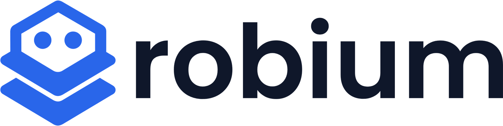

<div align="center">

<picture>
  <source media="(prefers-color-scheme: dark)" srcset="assets/brand/robium-lockup-dark.png">
  
</picture>

### Physical AI skills for your agents

An open-source, continuously evolving collection of field-tested robotics<br>
expertise. Install robium as a plugin to empower your favorite AI coding<br>
agent with the robotics skills it needs.<br>
Covers ROS 2, Nav2, Gazebo, MuJoCo, NVIDIA Isaac Sim, Isaac Lab, and LeRobot,<br>
for Claude Code, Codex, Gemini CLI, and Cursor.

[](https://github.com/robium-ai/robium/actions/workflows/skills.yml)
[](https://robium.ai)
[](https://www.npmjs.com/package/robium-ai)
[](./LICENSE)
[](https://robium.ai/join/discord)
[](https://huggingface.co/robium)

</div>

## Install

**Quick**: clone the repository once and install Robium for every supported
agent detected on your machine:

```bash
npx robium-ai setup                  # auto-detects your agents
npx robium-ai setup --agent codex    # or target one
npx robium-ai update                 # pull Robium and refresh integrations
npx robium-ai remove                 # remove integrations; keep the checkout
npx robium-ai doctor                 # verify activation and installed versions
```

The default clone lives at `~/robium` and is a normal Git checkout you can
use for contributions. Choose another location with `--dir`, for example
`npx robium-ai setup --dir ~/repos/robium`.

| Agent | Full Robium integration | Live skill source |
| --- | --- | --- |
| Claude Code | Native Claude plugin | Robium checkout; Claude caches released plugins |
| Codex | Native OpenAI plugin | Robium checkout; Codex caches installed plugins |
| Gemini CLI | Native extension: skills, architect subagent, capture hooks | Linked Robium checkout |
| Cursor | Native Agent Skills | Links to the checkout |

Codex Desktop is detected on macOS even when its bundled `codex` executable
is not on your shell `PATH`.

To install only one portable skill instead of the full Robium integration:

```bash
npx skills add robium-ai/robium -g --skill nav2 --agent codex
npx skills update -g
```

**Native install**: clone the repository, then use your agent's own package
flow where one is available:

```bash
git clone https://github.com/robium-ai/robium ~/robium

# Claude Code: plugin with skills, architect agent, and capture hooks
claude plugin marketplace add ~/robium && claude plugin install robium@robium

# Codex: native plugin
codex plugin marketplace add ~/robium && codex plugin add robium@robium

# Gemini CLI: extension with automatic updates
gemini extensions install https://github.com/robium-ai/robium --auto-update

# Cursor: standard Agent Skills linked from the checkout
npx robium-ai setup --agent cursor --dir ~/robium
```

The repository remains the source of truth. `npx robium-ai update` pulls it,
repairs skill links, and refreshes native plugin installations. Start a new
agent session after a native plugin update.

Gemini-specific install, update, removal, permission, and fail-open details are
in [docs/gemini-cli.md](./docs/gemini-cli.md).

Your application stays in its own repository; Robium lives beside it. Use the
reference apps as starting points and contribute reusable fixes back.

## How it fits

Robium provides robotics expertise. Your project provides the context. Your AI
coding agent handles architecture, implementation, simulation, testing, and
deployment.

Captured build learnings can improve future skill versions. See the workflow
at [robium.ai](https://robium.ai/#how-it-fits). External users can contribute a
[sanitized build finding](./CONTRIBUTING.md#contributing-a-sanitized-build-finding)
without sharing a raw agent transcript.

## What's inside

```
robium/
├── skills/          the catalog: versioned, hand-crafted, validator-enforced
├── agents/          robium-architect: researches the stack, writes your brief
├── .claude-plugin/  Claude Code package
├── .codex-plugin/   Codex package manifest
├── .agents/plugins/ Codex-native repository marketplace
├── hooks/           shared host hooks plus Gemini's native event adapter
├── AGENTS.md        canonical Codex-native maintainer guidance
├── gemini-extension.json  Gemini CLI extension
├── learnings/       field evidence from real builds, input to the learning loop
└── cli/             npx robium-ai: setup, doctor, skill search
```

The reference applications live in
[robium-ai/robium-apps](https://github.com/robium-ai/robium-apps) and the
robium.ai site + live-demo infrastructure in
[robium-ai/robium-website](https://github.com/robium-ai/robium-website).

The catalog in one view: every skill is one folder under
[`skills/`](./skills), browsable on [robium.ai](https://robium.ai):

| Pillar | Skills |
| --- | --- |
| Architecture & proof | `architect` · `testing` · `test-assets` · `live-demo` · `cloud-run` · `runpod` |
| Simulation | `simulation` · `gazebo` · `mujoco` · `isaac-sim` · `isaac-lab` |
| Data & learning | `data` · `lerobot` · `huggingface` |
| Visualization | `visualization` · `foxglove` · `rerun` · `rviz2` |
| Robotics integration | `ros2` · `nav2` · `integration` · `environments` |
| Catalog upkeep | `skill-author` · `learning-loop` · `mining` |

**Umbrella skills** own decisions (which simulator, where data comes from, how
to test); **tool skills** own the mechanics of one library. `architect` is the
entry point and routes to everything else.

## A catalog that maintains itself

Robotics guidance rots fast: APIs move, versions pair differently, commands
change shape. robium is built to notice:

- **Capture**: hooks record what broke and what fixed it during real build
  sessions; [`learnings/`](./learnings) holds the evidence.
- **Mine**: the ecosystem's proven patterns are read out of real repos, with
  citations that must still hold at the pinned commit.
- **Absorb**: evidence-gated pull requests fold both back into the versioned
  skills. Agents draft; a human merges every change.
- **Verify**: version facts are checked against live upstream docs at
  authoring time, and each claim states how it was verified. Prior skill
  versions stay browsable under [`archive/`](./archive).

## Contributing

The contribution unit is small on purpose: **one skill, no build system**.
If you installed Robium with `npx robium-ai setup`, reuse its checkout—do not
clone it again:

```bash
cd ~/robium                       # or the location supplied with --dir
./scripts/bootstrap.sh
git switch -c my-skill-fix
```

Pick a robotics tool you know, edit its skill, and run the repository check:

```bash
./scripts/check.sh
```

[CONTRIBUTING.md](./CONTRIBUTING.md) has the five-step walkthrough;
[`good-first-skill`](https://github.com/robium-ai/robium/labels/good-first-skill)
issues are the on-ramp. Questions:
[Discord](https://robium.ai/join/discord) or
[Discussions](https://github.com/robium-ai/robium/discussions).

## License

[MIT](./LICENSE). See [CONTRIBUTING.md](./CONTRIBUTING.md) for the skill format,
quality bar, and development workflow.
